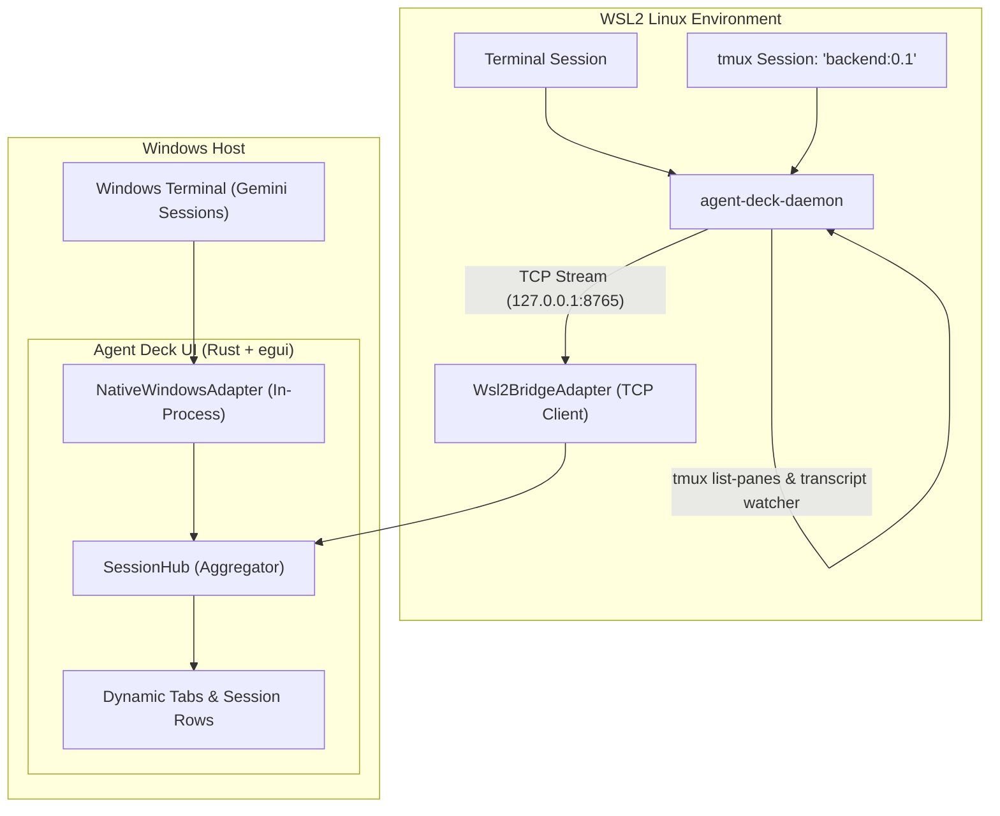

# 🎛️ Agent Deck (`agent-deck`)

A retro **Winamp-inspired** floating desktop activity deck and multi-stream session monitor for AI coding assistants (**Gemini / Antigravity**, **Claude Code**) running natively on **Windows** and inside **WSL2** (including native **`tmux`** session tracking).

```
┌──────────────────────────────────────────────────────────────────[─][▲][✕]┐
│ 🎛️ AGENT-DECK v0.3                                                         │
├───────────────────────────────────────────────────────────────────────────┤
│   ○ Windows • 2       ● WSL2 • 3                                          │
├───────────────────────────────────────────────────────────────────────────┤
│ ┌─ tmux:backend:0.1 • INPUT REQUIRED ──────────────── STEP 050 ─[▂▃▅▆]──┐ │
│ │  INPUT REQUIRED: Confirm running migrations on postgres-dev [Y/n]     │ │
│ └───────────────────────────────────────────────────────────────────────┘ │
│ ┌─ tmux:worker:0.0 • RUNNING: CARGO_TEST ──────────── STEP 074 ─[ ▂▃ ]──┐ │
│ │  TEST: cargo test --test api_gateway (18/22 passed)                   │ │
│ └───────────────────────────────────────────────────────────────────────┘ │
├───────────────────────────────────────────────────────────────────────────┤
│ ● 5 active • 1 requiring input       Click to Ack • Drag corner to resize │
└───────────────────────────────────────────────────────────────────────────┘
```

---

## ✨ Features

- **Hardware / Environment Tabs**:
  - Declarative, config-driven tabs grouping all concurrent sessions by environment (`🪟 Windows` and `🐧 WSL2`).
- **Thick Tactile Session Rows**:
  - **Status LED with Halo**:
    - 🟢 **Solid Emerald**: Thinking / Reasoning.
    - 🟢 **Solid Green**: Tool execution (e.g. `replace_file_content`, `cargo_test`).
    - 🟡 **Pulsing Amber**: **Action Required** (waiting on user prompt or `[y/n]` confirmation).
    - 🟡 **Steady Solid Amber**: Acknowledged input wait.
    - 🔵 **Cyan**: Finished / Ready for PR.
    - 🔴 **Red**: Error / crashed.
  - **`tmux` Metadata Capture**: Automatically detects and displays active `tmux` session, window, and pane information (e.g. `tmux:backend:0.1`).
  - **1-Line Ticker Marquee**: Smooth horizontal scrolling LCD text displaying live tool summaries, prompt previews, and thinking states.
  - **Per-Session VU Equalizer**: Dancing 6-segment LED bars visualizing live activity and streaming flux.
- **Smart Attention & Ack Tracking (`AttentionState`)**:
  - **Calm Startup**: Starts without annoying blinking on launch.
  - **Real-Time Alerting**: Actively pulses/blinks yellow only when an active session transitions into `WaitingForInput`.
  - **Interactive Ack**: Clicking a tab acknowledges all sessions in that tab; clicking an individual row acknowledges that specific session (turning the LED to steady solid amber).
  - **Auto Reset**: Automatically resets acknowledgment when the agent transitions to a new state.
- **Floating & Fully Reactive Window**:
  - Always-on-top, frameless, draggable chassis.
  - Tactile resize corner grip (`◿`) with safe minimum bounds (`440 x 130px`) and responsive vertical scroll area that automatically reveals more rows as you expand the height.
  - Windowshade mini-mode (`▲ / ▼`) for a clean single-line bar.

---

## 🏗️ Architecture

Organized as a modular **Cargo Workspace**:

```
agent-deck/
├── Cargo.toml               # Workspace Coordinator
├── AgentDeck.exe            # Standalone Windows Release Binary
├── Launch.bat               # One-click Windows Launcher
│
└── crates/
    ├── agent-deck-core/     # 📦 Shared Domain Protocol (AgentState, SessionEvent, SessionMetadata)
    ├── agent-deck-ui/       # 🖥️ Windows GUI (Rust + eframe/egui + Stream Adapters)
    └── agent-deck-daemon/   # 🐧 WSL2 Linux Bridge Daemon (tokio + tmux inspector + transcript watcher)
```

### The Stream Adapter Pattern



---

## 🚀 Getting Started

### 1. Running on Windows

You can launch the pre-compiled standalone binary directly:
- Double-click **`AgentDeck.exe`** (or run **`Launch.bat`**).

To build and run from source:
```powershell
cargo run -p agent-deck-ui --release
```

---

### 2. Setting Up the WSL2 Bridge Daemon

Inside your WSL2 Linux terminal:

```bash
cd crates/agent-deck-daemon
./install.sh
agent-deck-daemon
```

*The daemon will automatically monitor `~/.gemini/antigravity-cli/brain/` and `~/.claude/` in WSL2, query `tmux list-panes` for active session metadata, and stream events to the Windows desktop widget over `127.0.0.1:8765`.*

---

## 📄 License

MIT
