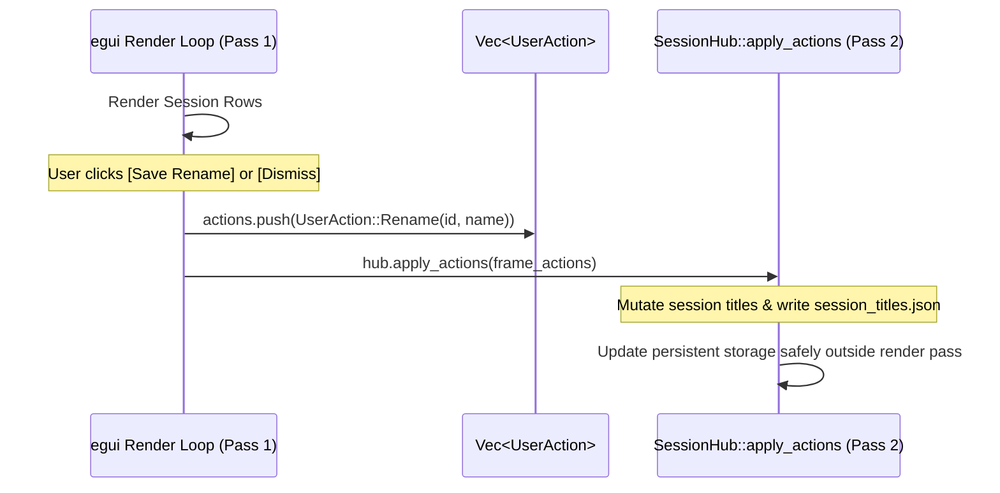

# 🎛️ Agent Deck — Architecture, Data Flow & System Design

This document provides a comprehensive technical breakdown of **Agent Deck**, detailing its multi-crate workspace structure, end-to-end data pipelines, daemon collection strategies, kernel-level and heartbeat-driven liveness tracking, and the mechanics of its immediate-mode desktop user interface.

---

## 1. High-Level Architecture & Topology

Agent Deck is structured as a modular Rust Cargo workspace designed to aggregate, normalize, and visualize concurrent autonomous AI coding assistant sessions (e.g., Antigravity CLI / Gemini, Claude Code) operating across both host Windows environments and nested WSL2 Linux distributions.

### Workspace Crates

| Crate | Target | Role / Responsibilities |
| :--- | :--- | :--- |
| [`agent-deck-core`](../crates/agent-deck-core/src/lib.rs) | `no_std` compatible / Core Rust | Shared domain models, protocol definitions, state machines ([`AgentState`](../crates/agent-deck-core/src/lib.rs#L4-L13), [`SessionEvent`](../crates/agent-deck-core/src/lib.rs#L25-L35), [`SessionMetadata`](../crates/agent-deck-core/src/lib.rs#L15-L23)), and badge formatting helpers ([`format_channel_label`](../crates/agent-deck-core/src/lib.rs#L60-L70)). |
| [`agent-deck-daemon`](../crates/agent-deck-daemon/src/main.rs) | Linux (WSL2) | Headless background daemon running on `tokio`. Scans Linux transcript logs, inspects `tmux` pane metadata, serializes state updates to JSON lines, and serves them via an async TCP broadcast socket. |
| [`agent-deck-ui`](../crates/agent-deck-ui/src/main.rs) | Windows | Winamp-inspired floating desktop monitor built with `eframe` / `egui`. Runs background adapters, aggregates event streams into a central hub, coordinates user actions, and renders tactical LED status indicators, dancing VU meters, and marquee tickers. |

### Topology Diagram

```mermaid
flowchart TB
    subgraph WSL2["🐧 WSL2 Linux Environment (Guest)"]
        CLI_WSL["Antigravity / Gemini CLI<br/>(agy running in tmux)"]
        BRAIN_WSL["~/.gemini/.../brain/<br/>transcript.jsonl"]
        TMUX["tmux server<br/>(tmux list-panes)"]
        DAEMON["agent-deck-daemon<br/>(TranscriptWatcher + TmuxInspector)"]
        TCP_SRV["Tokio TCP Listener<br/>0.0.0.0:8765"]

        CLI_WSL -->|Appends steps| BRAIN_WSL
        DAEMON -->|Incremental Seek Poll (400ms)| BRAIN_WSL
        DAEMON -->|Subprocess query| TMUX
        DAEMON -->|Broadcast JSONL stream| TCP_SRV
    end

    subgraph WindowsHost["🪟 Windows Desktop Host"]
        CLI_WIN["Antigravity CLI (agy.exe)"]
        PRESENCE_DIR["%USERPROFILE%/.gemini/.../presence/<br/>[session_id].lock"]
        BRAIN_WIN["%USERPROFILE%/.gemini/.../brain/<br/>transcript.jsonl"]

        CLI_WIN -->|Holds OS File Lock| PRESENCE_DIR
        CLI_WIN -->|Appends steps| BRAIN_WIN

        subgraph AgentDeckUI["🖥️ agent-deck-ui (eframe / egui)"]
            WIN_ADAPTER["NativeWindowsAdapter<br/>(Thread + Kernel Lock Check)"]
            WSL_ADAPTER["Wsl2BridgeAdapter<br/>(TCP Stream Client 127.0.0.1:8765)"]
            HUB["SessionHub<br/>(mpsc ingestion, prioritization, deduplication)"]
            RENDER["Immediate Mode Render Loop<br/>(eframe ~60 FPS / request_repaint_after)"]

            WIN_ADAPTER -->|SessionEvent| HUB
            WSL_ADAPTER -->|SessionEvent| HUB
            HUB -->|State snapshot| RENDER
        end

        PRESENCE_DIR -.->|Kernel share_mode(0) check| WIN_ADAPTER
        BRAIN_WIN -->|Incremental Seek Poll (400ms)| WIN_ADAPTER
        TCP_SRV ===|Forwarded Port 8765 / Localhost TCP| WSL_ADAPTER
    end
```

---

## 2. End-to-End Data Flow Pipeline

The system uses a pull-and-broadcast pipeline that decouples the execution lifecycle of CLI agents from the graphical desktop presentation:

1. **CLI Execution & Transcript Ingestion**:
   - As an agent executes prompts and tools, the CLI streams discrete JSON event objects into its session directory at `.system_generated/logs/transcript.jsonl`.
2. **Adapter & Daemon Polling**:
   - **On Windows**: [`NativeWindowsAdapter`](../crates/agent-deck-ui/src/adapter/native_windows.rs#L15-L21) periodically scans the local `brain/` directory every 400ms.
   - **In WSL2**: [`agent-deck-daemon`](../crates/agent-deck-daemon/src/main.rs) via [`TranscriptWatcher`](../crates/agent-deck-daemon/src/transcript.rs#L10) scans the Linux user directory every 400ms.
3. **Delta Extraction**:
   - Rather than reading whole files repeatedly, each watcher stores the file's byte offset (`last_pos`). When a file grows (`file_len > last_pos`), it issues a `SeekFrom::Start(last_pos)` to stream only newly written lines.
4. **Normalization into Protocol Events**:
   - The JSON lines are parsed using `serde_json`. The watcher analyzes `step_type`, `source`, `status`, and `tool_calls` to compute the canonical [`AgentState`](../crates/agent-deck-core/src/lib.rs#L4-L13).
   - Concurrently, session titles are derived via [`extract_earliest_markdown_heading`](../crates/agent-deck-daemon/src/transcript.rs#L18-L63) / [`extract_workdir_basename`](../crates/agent-deck-daemon/src/transcript.rs#L65-L102), and runtime metadata (such as `tmux` pane indices) is resolved via [`TmuxInspector`](../crates/agent-deck-daemon/src/tmux.rs#L13-L103).
5. **Cross-Thread & Network Ingestion**:
   - Native Windows events are transmitted over standard `std::sync::mpsc::Sender<SessionEvent>` channels.
   - WSL2 events are broadcast over an asynchronous `tokio::sync::broadcast` TCP stream on port `8765`. [`Wsl2BridgeAdapter`](../crates/agent-deck-ui/src/adapter/wsl2_bridge.rs#L9-L19) reads and forwards them into the identical UI `mpsc` queue.
6. **Central Hub Synchronization**:
   - During each UI frame, [`SessionHub::poll_events()`](../crates/agent-deck-ui/src/hub.rs#L217) drains pending channel items with non-blocking `try_recv()`, updates the [`ActiveSession`](../crates/agent-deck-ui/src/hub.rs#L142-L155) table, updates the [`AttentionState`](../crates/agent-deck-ui/src/hub.rs#L26-L30) machine, and sorts rows by urgency.

---

## 3. Daemon Collection & Extraction Engine (`agent-deck-daemon`)

The daemon is a lightweight, zero-configuration background utility designed to run inside WSL2 environments without requiring root privileges or GUI dependencies.

### Incremental Log Scanning
In [`transcript.rs`](../crates/agent-deck-daemon/src/transcript.rs), [`TranscriptWatcher`](../crates/agent-deck-daemon/src/transcript.rs#L10) keeps a map of visited transcript files:
```rust
watched_sessions: HashMap<PathBuf, u64>, // Path -> Last read byte position
```
- **File Length Comparison**: During each 400ms tick, `std::fs::metadata` checks if the file has expanded.
- **Initial Warm-up (Tail Seek)**: If a session transcript is already hundreds of kilobytes or megabytes upon daemon startup, seeking from 0 would cause unnecessary deserialization churn. The engine seeks directly to `file_len - 8192` (the last 8KB) to retrieve the latest state immediately:
  ```rust
  if last_pos == 0 && file_len > 8192 {
      let _ = file.seek(SeekFrom::Start(file_len - 8192));
  } else {
      let _ = file.seek(SeekFrom::Start(last_pos));
  }
  ```
- **Historical Pruning**: Sessions whose `transcript.jsonl` has not been modified within the last 3 days (`86400 * 3` seconds) are skipped to prevent memory accumulation.

### JSONL State Parsing & Classification
Each entry in `transcript.jsonl` maps to an agent trajectory step. The daemon classifies these steps into distinct states:

```rust
// 1. Tool Call Step (Awaiting confirmation or running)
if let Some(tool_calls) = json.get("tool_calls").and_then(|v| v.as_array()) {
    if let Some(first_tool) = tool_calls.first() {
        // In interactive CLI mode, tool invocations await user permission
        (
            AgentState::WaitingForApproval { name, summary },
            format!("PERMISSION REQUIRED: {} ({})", tool_summary, tool_action),
        )
    }
}
// 2. User Input Step
else if step_type == "USER_INPUT" || source == "USER_EXPLICIT" {
    (AgentState::Thinking, format!("PROCESSING: {}", preview))
}
// 3. Planner Response Step Finished
else if step_type == "PLANNER_RESPONSE" && status == "DONE" {
    (AgentState::WaitingForInput { prompt_preview: "Ready for input".to_string() }, "WAITING FOR PROMPT".to_string())
}
```

### Semantic Title Resolution Hierarchy
Session UUIDs (`c02eb6fb-bfb0-...`) are unreadable on a high-density dashboard. The engine dynamically resolves human-readable titles using a 4-tier fallback hierarchy:

1. **User Custom Overwrite**: User renames entered in the UI, stored persistently in [`CustomTitlesStorage`](../crates/agent-deck-ui/src/hub.rs#L91-L95) (`%APPDATA%/agent-deck/session_titles.json`).
2. **Earliest Markdown `# Heading 1`**: Analyzes generated markdown artifacts in the session's directory (e.g. `brain/<session_id>/*.md` such as implementation plans or walkthroughs via [`extract_earliest_markdown_heading`](../crates/agent-deck-daemon/src/transcript.rs#L18-L63)). It cleans prefixes like `Implementation Plan:`, removes formatting characters, and truncates to 34 characters.
3. **Workspace Basename**: Parses early transcript steps or tool parameters (`SearchPath`, `Cwd`) for project root patterns via [`extract_workdir_basename`](../crates/agent-deck-daemon/src/transcript.rs#L65-L102) (e.g., extracting `agent-deck` from `C:/Users/.../workbench/agent-deck`).
4. **Truncated Session ID**: Falls back to `Session <first 6 characters>`.

### Tmux Metadata Inspection
In [`tmux.rs`](../crates/agent-deck-daemon/src/tmux.rs), [`TmuxInspector`](../crates/agent-deck-daemon/src/tmux.rs#L13-L103) executes:
```bash
tmux list-panes -a -F "#{pane_pid} #{session_name} #{window_index} #{pane_index} #{window_name} #{pane_current_path}"
```
It attributes a session to a specific pane using [`TmuxInspector::resolve_metadata`](../crates/agent-deck-daemon/src/tmux.rs#L63-L102):
- Direct PID matching (`pane_pid == target_pid`).
- Working directory prefix matching (`target_cwd.starts_with(&pane.current_path)`).
- Single-session fallback when only one session exists.
The result is formatted into tags like `tmux:backend:0.1`.

### Tokio Async TCP Broadcast Server
In [`main.rs`](../crates/agent-deck-daemon/src/main.rs#L13-L134), the daemon binds to `0.0.0.0:8765` using `tokio::net::TcpListener`.
- When a Windows UI instance connects:
  1. An immediate handshake event is dispatched ([`SessionEvent`](../crates/agent-deck-core/src/lib.rs#L25-L35) with [`AgentState::Idle`](../crates/agent-deck-core/src/lib.rs#L6), agent type `"Bridge"`).
  2. A warm snapshot of all currently active sessions is flushed over the socket via [`TranscriptWatcher::get_latest_sessions`](../crates/agent-deck-daemon/src/transcript.rs#L122-L124).
  3. The client task subscribes to a `tokio::sync::broadcast::channel` to receive real-time updates pushed by the 400ms polling loop.

---

## 4. Liveness, Presence & Process Lifecycle Detection

One of the biggest challenges in monitoring local CLI agents is determining whether an inactive agent is **actually running** (e.g., waiting for input) or **dead** (terminated by <kbd>Ctrl</kbd>+<kbd>C</kbd>, crash, or closed terminal), without burning CPU cycles on continuous process scanning.

### Windows Native: Kernel-Level Exclusive File Locking
On Windows, the Antigravity CLI creates an OS lockfile at `.gemini/antigravity-cli/presence/<session_id>.lock` while its process is alive.

In [`native_windows.rs`](../crates/agent-deck-ui/src/adapter/native_windows.rs#L24-L45), [`is_session_process_active`](../crates/agent-deck-ui/src/adapter/native_windows.rs#L24-L45) inside [`NativeWindowsAdapter`](../crates/agent-deck-ui/src/adapter/native_windows.rs#L15-L21) takes advantage of Windows kernel file sharing semantics:

```rust
#[cfg(target_os = "windows")]
use std::os::windows::fs::OpenOptionsExt;

fn is_session_process_active(presence_dir: &Path, session_id: &str) -> bool {
    let lock_file = presence_dir.join(format!("{}.lock", session_id));
    if !lock_file.exists() {
        return false;
    }

    // Attempt to open the lock file exclusively with share_mode(0) (zero sharing allowed)
    match OpenOptions::new().read(true).write(true).share_mode(0).open(&lock_file) {
        // Opened exclusively -> No external process holds an open handle -> Dead
        Ok(_) => false, 
        // Sharing Violation (ERROR_SHARING_VIOLATION) -> Held open by running agy.exe -> Alive
        Err(_) => true, 
    }
}
```

#### Why this is beneficial
- **Zero Overhead**: Does not call `CreateToolhelp32Snapshot` or WMI process enumeration.
- **Immediate Response**: The microsecond the CLI process terminates or crashes, the Windows kernel releases all associated file handles. The next 400ms scan detects that `share_mode(0)` succeeds, immediately identifying the session as dead.

### WSL2 Bridge Liveness & Heartbeats
Because file-lock semantics do not cross the VM hypervisor boundary between WSL2 and Windows:
1. **Heartbeat Pulses**: The WSL2 daemon emits a synthetic heartbeat [`SessionEvent`](../crates/agent-deck-core/src/lib.rs#L25-L35) with `agent_type: "Bridge"` every ~3.2 seconds.
2. **Heartbeat Tracking in UI**: [`SessionHub`](../crates/agent-deck-ui/src/hub.rs#L185-L195) maintains a map of `connected_bridges` (`Distro -> Last Heartbeat Instant`).
3. **Automatic Disconnection Detection**: If no heartbeat arrives for >8 seconds, the UI marks the bridge as offline and removes its dynamic tabs.
4. **Stale Session Demotion**: Any session without updates for >15 minutes is marked [`ActiveSession::is_stale()`](../crates/agent-deck-ui/src/hub.rs#L158-L160), its VU meters decay to zero, and its sort priority is demoted to `99`.

---

## 5. UI Wiring & The Immediate Mode Render Loop (`agent-deck-ui`)

The UI is built with `eframe` and `egui`, utilizing an **Immediate Mode Graphical User Interface (IMGUI)** architecture.

### Immediate Mode Mental Model
Unlike Retained Mode GUI toolkits (DOM, WPF, Qt) where a tree of persistent widget objects is created and modified via callbacks:
- In `egui`, the UI function ([`eframe::App::update`](../crates/agent-deck-ui/src/main.rs#L485)) executes from scratch on every frame.
- State is held in plain Rust data structures inside [`SessionHub`](../crates/agent-deck-ui/src/hub.rs#L185-L195) and [`AgentDeckApp`](../crates/agent-deck-ui/src/main.rs#L73-L82).
- Adding a button (`ui.button(...)`) executes layout calculation, hit-testing, and draw command emission in one single pass.

### Frame Scheduling & Continuous Animations
The application requires fluid animations (scrolling text marquees, dancing VU equalizer bars, breathing LED glow rings). To ensure constant ~60 FPS animation without saturating the CPU:
```rust
impl eframe::App for AgentDeckApp {
    fn update(&mut self, ctx: &egui::Context, _frame: &mut eframe::Frame) {
        // Explicitly request the next frame tick in 16ms (~60Hz)
        ctx.request_repaint_after(Duration::from_millis(16));

        let now = Instant::now();
        let dt = now.duration_since(self.last_frame_time).as_secs_f32();
        self.last_frame_time = now;
        self.pulse_phase += dt * 4.0;
        ...
```

### Channel Ingestion Loop
Before rendering widgets, the UI polls all background streams:
```rust
pub fn poll_events(&mut self) {
    while let Ok(event) = self.rx.try_recv() {
        // Update existing ActiveSession or allocate new entry
        // Update attention state and transition signatures
    }
}
```
Because `try_recv()` is non-blocking, it consumes all pending updates immediately without ever blocking the UI thread.

### Two-Pass Deferred Action Queue
In Rust, you cannot easily mutate a collection while iterating over it to render UI elements. To resolve this, Agent Deck employs a **Two-Pass Deferred Action Queue**:



1. **Pass 1 (Draw & Collect)**: As rows are rendered in [`AgentDeckApp::render_session_row`](../crates/agent-deck-ui/src/main.rs#L114-L481), any user interaction (clicking a row, pressing <kbd>Enter</kbd> to rename, clicking dismiss) appends a [`UserAction`](../crates/agent-deck-ui/src/hub.rs#L17-L23) enum into a local `Vec<UserAction>`.
2. **Pass 2 (Apply Mutations)**: After UI layout completes, [`SessionHub::apply_actions`](../crates/agent-deck-ui/src/hub.rs#L291-L337) executes the collected actions against the internal data structures and updates persistent storage on disk via [`CustomTitlesStorage`](../crates/agent-deck-ui/src/hub.rs#L91-L95).

### Dynamic Environment Filtering
The environment tabs at the top (`Windows`, `clibox`, `ubuntu`, etc.) are computed dynamically by [`SessionHub::active_categories`](../crates/agent-deck-ui/src/hub.rs#L352-L409) producing [`DynamicCategory`](../crates/agent-deck-ui/src/hub.rs#L9-L14) structs:
- `Windows` is designated as a permanent anchor (`is_permanent = true`).
- WSL2 distributions and remote hosts are discovered dynamically from active session streams and connected bridge heartbeats.
- **Auto-Hide on 0 Sessions**: If an environment has 0 active sessions, its tab is hidden to reduce visual noise.

### Procedural Visual Primitives
All tactile elements avoid static image assets and are rendered procedurally using [`egui::Painter`](../crates/agent-deck-ui/src/main.rs#L164):
- **CRT Scanlines**: Horizontal lines drawn at 3-pixel intervals across rows using low-opacity alpha blending:
  ```rust
  let grid_color = Color32::from_rgba_unmultiplied(20, 45, 25, 30);
  for y in (row_rect.min.y as i32..row_rect.max.y as i32).step_by(3) {
      painter.line_segment([pos2(row_rect.min.x, y as f32), pos2(row_rect.max.x, y as f32)], Stroke::new(0.5, grid_color));
  }
  ```
- **Dancing VU Meter**: A procedural 6-bar equalizer driven by composite sine and cosine trigonometric waves:
  ```rust
  let wave = ((pulse_phase * 2.8 + i as f32 * 0.6).sin() * 0.5 + 0.5)
           * ((pulse_phase * 1.1 + (8 - i) as f32 * 0.4).cos() * 0.4 + 0.6);
  *bar = lerp(*bar, wave, dt * 12.0);
  ```
- **Status LED with Halo**: Concentric circles drawn with radial alpha attenuation, pulsating when user input or tool approval is needed.
- **One-Line Marquee Ticker**: Increments character offsets linearly (`dt * 38.0`) when the agent is actively executing tools, but clamps to `0.0` as soon as user interaction is required for readability.

---

## 6. Underlying Technology Stack & Out-of-the-Box Capabilities

### `egui` & `eframe`
- **Immediate Mode Efficiency**: By redrawing only what changes and retaining no bulky DOM state, memory overhead remains under ~30MB RSS.
- **Viewport Commands**: Agent Deck takes advantage of `egui`'s native viewport capabilities:
  - `ViewportCommand::StartDrag`: Attaches mouse drag events on the top title bar or chassis directly to the OS window manager for seamless dragging.
  - `ViewportBuilder::default().with_decorations(false).with_always_on_top()`: Configures a frameless, retro, floating desktop widget out-of-the-box.
- **Dynamic Font Scaling**: Modifies font definitions at runtime (`A+` / `A-` buttons) by scaling coordinate geometry proportionally.

### `tokio` (Async I/O Runtime)
- **Non-blocking TCP Multiplexing**: Handles daemon client connects, disconnections, and reconnections concurrently without blocking the transcript polling thread.
- **`tokio::sync::broadcast`**: Provides a multi-producer, multi-consumer broadcast channel where slow or dropped Windows UI connections do not impact the core filesystem scanner.

### Win32 File API (`windows-sys` / `OpenOptionsExt`)
- Direct interaction with Windows kernel file-sharing modes (`FILE_SHARE_READ`, `FILE_SHARE_WRITE`, or `0` for exclusive access) allows instantaneous detection of process death without polling the Windows process table.

### `tmux` CLI
- Exposes machine-readable pane inspection flags (`tmux list-panes -F`), providing a clean path to attribute autonomous CLI processes running in background windows back to their corresponding terminal views.
