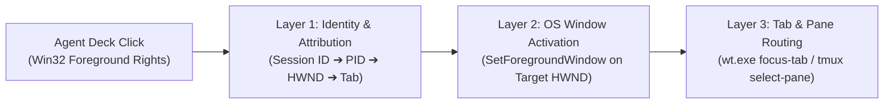

# 🧭 Technical Feasibility: Session Row Click to Target Window, Tab & tmux Pane Navigation

## Tracking Issue
- GitHub Issue: [#1 — feat: Navigate from session row click to target window, tab, and tmux pane](https://github.com/mojozinc/agent-deck/issues/1)

## Overview & User Story

### User Story
1. A developer has 4 autonomous agent sessions running concurrently (processing, thinking, running tools) across Windows and WSL2.
2. A session transitions to `APPROVAL REQUIRED` (or `WAITING FOR PROMPT`).
3. Agent Deck automatically sorts this session to the top (Priority Rank 1), and its row pulsates with an amber notification halo.
4. The user clicks directly on the session row.
5. The exact terminal window, tab, and tmux pane executing that session is immediately brought into foreground focus.

---

## Feasibility Verdict: Highly Feasible, Multi-Layered

Implementing this workflow is **technically feasible** on Windows 10/11 and WSL2. However, because the developer terminal ecosystem does not expose a single unified "bring tab to front" API, the architecture must solve three discrete layers:



---

## Detailed Architectural Layers

### Layer 1: Identity & Terminal Attribution (The "Where Is It Running?" Problem)
Agent Deck must correlate:
$$\text{Session ID} \longrightarrow \text{Agent PID} \longrightarrow \text{Parent Terminal Process (HWND)} \longrightarrow \text{Tab / Pane Identifier}$$

#### 1. On Native Windows
- **PID Discovery**:
  - Antigravity holds an exclusive kernel file lock on `%USERPROFILE%/.gemini/antigravity-cli/presence/<session_id>.lock`.
  - Windows provides the **Restart Manager API** (`RmStartSession`, `RmRegisterResources`, `RmGetList`), which queries the Windows kernel in microseconds for which active PID holds an open handle to that file path without scanning the entire process table.
  - For Claude Code sessions, transcripts in `%USERPROFILE%/.claude` or active process inspection (`claude.exe` / `node.exe`) identify the running PID.
- **Process Hierarchy Traversal**:
  - Walking the parent process tree using `CreateToolhelp32Snapshot` / `Process32Next`:
    $$\text{agy.exe} \longrightarrow \text{pwsh.exe / bash.exe} \longrightarrow \text{OpenConsole.exe} \longrightarrow \text{WindowsTerminal.exe}$$
  - Enumerate top-level windows (`EnumWindows`) matching the terminal PID to obtain the Win32 window handle (`HWND`).

#### 2. Inside WSL2 & tmux
- `agent-deck-daemon` already inspects tmux panes via:
  ```bash
  tmux list-panes -a -F "#{pane_pid} #{session_name} #{window_index} #{pane_index} #{window_name} #{pane_current_path}"
  ```
- By tracking the descendant process tree under `pane_pid` (via `/proc/<pane_pid>/task/*/children` or `pstree`), the daemon correlates the active agent session with its `tmux_session`, `tmux_window`, and `tmux_pane`.

---

### Layer 2: Windows OS Focus Stealing Rules (Win32 Foreground Rights)
Windows enforces strict foreground lock rules (`LockSetForegroundWindow` / `SetForegroundWindow` restrictions) to prevent background programs from stealing user focus unexpectedly (which would normally result in an orange flashing taskbar button).

- **Why this works seamlessly in this user story**:
  - The user **explicitly clicks** the session row inside `AgentDeck.exe`.
  - At the instant of click, `AgentDeck.exe` **is the active foreground window**.
  - Win32 explicitly grants foreground transfer permission to whichever process currently holds the foreground.
  - The window can be restored and focused reliably:
    ```rust
    unsafe {
        ShowWindow(target_hwnd, SW_RESTORE); // Restore if minimized
        SetForegroundWindow(target_hwnd);    // Bring to front
    }
    ```
  - **Key Rule**: The window activation call must be executed **synchronously** within the UI click event dispatch rather than on a detached asynchronous timer where foreground privilege may expire.

---

### Layer 3: Terminal Tab & tmux Pane Routing

#### A. Windows Terminal (`wt.exe`)
Windows Terminal supports command-line actions targeting existing windows without spawning new instances:
```powershell
wt.exe -w 0 focus-tab -t <tab_index>
```
- `-w 0`: Targets the most recently active Windows Terminal window.
- `focus-tab -t <tab_index>`: Focuses the specified 0-indexed tab.
- *Tab Drift Mitigation*: If tabs are dynamically opened or closed, static indices can drift. Windows Terminal allows targeting named tabs (`wt -w 0 nt --title "Session-Name"`), enabling `focus-tab -n <title>`.

#### B. tmux inside WSL2
If the session is running inside tmux:
```bash
tmux select-window -t "<session_name>:<window_index>"
tmux select-pane -t "<session_name>:<window_index>.<pane_index>"
```
- **Attached vs. Detached Scenarios**:
  - **Client Attached**: Running `select-window` and `select-pane` instantly updates the view in the user's terminal. Agent Deck then brings the host terminal window to the front.
  - **Client Detached (Headless)**: If no client is attached (`tmux list-clients -t <session>` returns empty), Agent Deck opens a new tab in Windows Terminal attached to the session:
    ```powershell
    wt.exe -w 0 new-tab wsl.exe -d clibox tmux attach -t <session_name>
    ```

#### C. Other Terminal Emulators
- **Alacritty / Classic conhost**: Single window per session; focusing `HWND` is sufficient.
- **WezTerm**: Provides first-class CLI IPC (`wezterm cli activate-tab --tab-id <id>` and `wezterm cli activate-pane --pane-id <id>`).
- **VS Code Integrated Terminal**: External CLI commands cannot switch internal VS Code terminal tabs without a companion VS Code extension or URI handler (`vscode://...`). In fallback mode, Agent Deck brings the main `Code.exe` window to the front.

---

## Summary of Technical Requirements & Edge Cases

1. **Lazy On-Demand Attribution**:
   - Do **not** poll process trees or window handles in the 400ms background scan.
   - Run PID/HWND resolution only on-demand when `response.clicked()` fires on a session row.
2. **WSL Bridge Navigation RPC**:
   - Add a lightweight command message across the existing TCP bridge (`127.0.0.1:8765`), allowing `agent-deck-ui` to request `agent-deck-daemon` to execute `tmux select-window / select-pane`.
3. **Graceful Fallback Hierarchy**:
   1. If `tmux_session` is present $\rightarrow$ Run `tmux select-window/pane` $\rightarrow$ Focus host terminal `HWND`.
   2. If Windows Terminal process found $\rightarrow$ Focus `HWND` + dispatch `wt.exe -w 0 focus-tab`.
   3. If generic terminal process (VS Code, Alacritty, ConEmu) $\rightarrow$ Focus top-level `HWND`.
   4. If tmux session is detached $\rightarrow$ Spawn `wt.exe new-tab wsl -d <distro> tmux attach -t <session>`.
